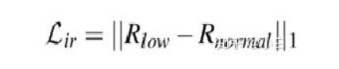

## Retinex 理论

 一幅给定的图像S(x,y)可以分解为两个不同的图像：反射图像R(x,y)和亮度图像（也有人称之为入射图像）L(x,y) 

其中R是物体自身的属性L与光照条件有关

## Retinex-Net

 一种基于Retinex理论的卷积神经网络模型——RetinexNet，该模型是2018年发表在BMVC上的，论文题目是《Deep Retinex Decomposition for Low-Light Enhancement》 

 模型的损失函数由重建损失、反射分量一致性损失和光照分量平滑损失三部分组成 ：

L = Lrecon + λLr	+ λLs

 反射分量一致性损失 

 根据Retinex图像分解理论，反射分量 ![[公式]](https://www.zhihu.com/equation?tex=R) 与光照无关，因此成对的低/正常光照图像的反射分量 ![[公式]](https://www.zhihu.com/equation?tex=R) 应该尽可能一致 

 光照分量平滑损失 :没看懂！

## CycleDeHaze

## 报告老板，我有一个大胆的想法!!

Retinex+CycleGAN-> 制作数据集

损失：

1. 重建损失

   L = |R*S - I|1 

2. 判别损失

